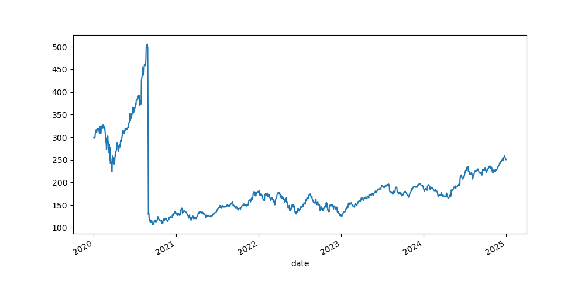
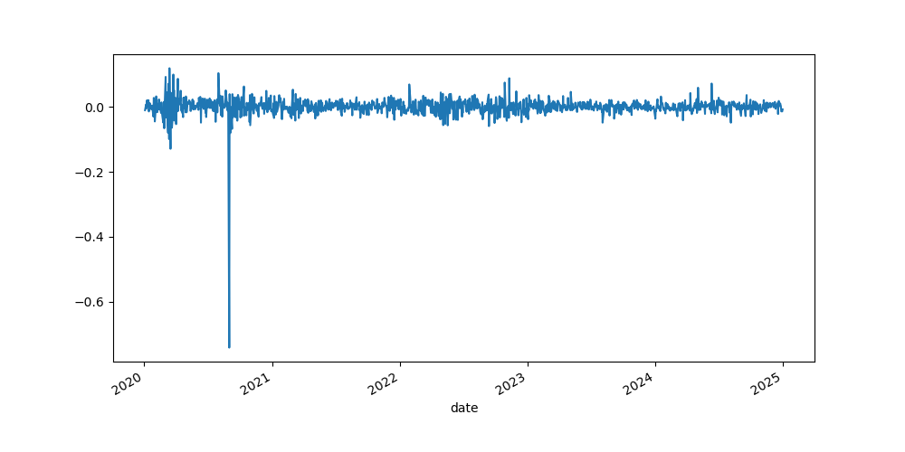

# ACC102 Track 2 WRDS Stock Analysis

## 1. Problem & User
This project analyses stock price trends and return volatility using real financial data, designed for finance students and beginner investors.

## 2. Data
- Source: WRDS CRSP Daily Stock File
- Access date: 2026-04-26
- Key fields: date, prc (adjusted closing price), daily return
- Source link: https://wrds-www.wharton.upenn.edu/

## 3. Methods
- Connect to WRDS database
- Extract data via SQL query
- Clean data by removing missing values
- Calculate daily returns using pct_change()
- Visualise price and return trends with matplotlib

## 4. Key Findings
- The stock shows a clear upward price trend over the period
- Daily returns exhibit significant volatility during market events
- The volatility pattern is consistent with large-cap tech stocks
- Price trend and return volatility are observable in the charts

## 5. How to run
1. Install required packages: pip install pandas matplotlib wrds
2. Open the .ipynb notebook
3. Run all cells sequentially

## 6. Product link / Demo
GitHub repository: [你的仓库链接]
Demo video: [你的视频链接]

## 7. Limitations & next steps
- Only one company is included in the analysis
- No comparison with market indices or peer stocks
- Future steps: add more stocks, include financial ratios and benchmark comparisons
